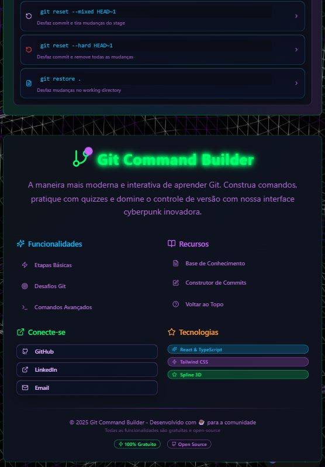
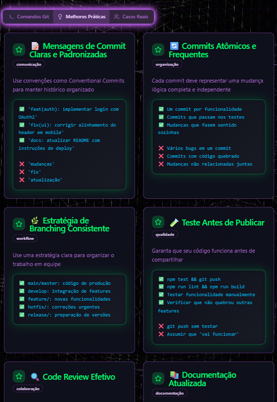

# 🧙‍♂️ Git Wizard Commander - Guia Interativo para Git!
<p align="center">
  
  
  
</p>

<div align="center">
  
</div>

## 📋 Sobre o Projeto
O **Git Wizard Commander** é uma plataforma web que facilita o uso e o aprendizado do Git por meio de uma interface interativa e visualmente moderna. Com foco em comandos práticos, quizzes e dicas, a aplicação oferece uma jornada intuitiva para dominar o Git — ideal para iniciantes e desenvolvedores que buscam padronização e produtividade.

## 🌐 Visualize o Projeto
👉 [**Git Wizard Commander**](https://devandreotti.github.io/git-wizard-commander/)

## ⚙️ Funcionalidades Principais
* **Construtor de Comandos Git**: Monte comandos passo a passo com base em ações reais do Git.
* **Construtor de Commits**: Gere mensagens padronizadas com tipo, escopo e descrição.
* **Dicas Diárias**: Receba insights rápidos sobre boas práticas e automações com Git.
* **Quizzes Interativos**: Teste seus conhecimentos com desafios em níveis variados.
* **Rastreamento de Progresso**: Veja seu avanço em quizzes, comandos e leitura de artigos.
* **Lista de Comandos Avançados**: Explore comandos úteis organizados por categoria.
* **Interface Responsiva e Estilosa**: Experiência cyberpunk com navegação fluida.

## 🛠 Tecnologias Utilizadas
* **[React](https://react.dev/)** — Biblioteca JavaScript para construir interfaces declarativas e reativas.
* **[TypeScript](https://www.typescriptlang.org/)** — Superset do JavaScript com tipagem estática para evitar erros em tempo de desenvolvimento.
* **[Vite](https://vitejs.dev/)** — Bundler ultrarrápido para desenvolvimento moderno com build instantâneo.
* **[Tailwind CSS](https://tailwindcss.com/)** — Framework utilitário para estilização rápida e responsiva com classes utilitárias.
* **[Spline](https://spline.design/)** — Ferramenta para inserir elementos 3D interativos direto na web.
* **[Shadcn UI](https://ui.shadcn.com/)** — Coleção de componentes acessíveis, prontos para produção e fáceis de customizar.
* **[Zod](https://zod.dev/)** — Biblioteca de validação e parsing com foco em segurança e integração com TypeScript.
* **[Lucide React](https://lucide.dev/)** — Conjunto de ícones modernos em SVG, personalizáveis via React.
* **[React Hook Form](https://react-hook-form.com/)** — Gerenciador leve e performático de formulários em React.
* **[React Router DOM](https://reactrouter.com/)** — Solução de roteamento declarativo para aplicações SPA em React.

## 📂 Estrutura do Projeto
```
git-wizard-commander/
├── public/
│   ├── favicon.ico
│   ├── placeholder.svg
│   └── robots.txt
└── src/
    ├── App.css
    ├── App.tsx
    ├── components/
    │   ├── AdvancedGitCommands.tsx
    │   ├── GitCommitBuilder.tsx
    │   ├── GitTipsOfTheDay.tsx
    │   ├── ArticleReadTracker.tsx
    │   ├── GitProgressTracker.tsx
    │   ├── QuizCompletionHandler.tsx
    │   ├── CommandCopyButton.tsx
    │   ├── GitQuizzes.tsx
    │   ├── GitStepsBuilder.tsx
    │   ├── SplineBackground.tsx
    │   └── ui/          
    ├── hooks/
    │   ├── use-mobile.tsx
    │   ├── use-toast.ts
    │   └── useProgressTracker.ts
    ├── lib/
    │   └── utils.ts
    ├── main.tsx
    ├── index.css
    └── pages/
        ├── GitCommandBuilder.tsx
        ├── GitKnowledgeBase.tsx
        ├── Index.tsx
        └── NotFound.tsx
```

## 🚀 Como Rodar Localmente
```bash
git clone https://github.com/seu-usuario/git-wizard-commander.git
cd git-wizard-commander
npm install
npm run dev
```

## 🔮 Melhorias Futuras
* Terminal interativo para simulações de comandos Git
* Visualização de histórico com grafo de commits
* Biblioteca de "receitas Git" para cenários comuns
* Suporte multilíngue e modo offline

## 🔄 Outras Fotos
<div align="center">
  
  
  
  
  
</div>

## 💪 Como Contribuir
1. Faça um fork do projeto.
2. Crie uma branch: `git checkout -b feature/nome-da-feature`.
3. Commit: `git commit -m "feat: nova feature"`.
4. Push: `git push origin feature/nome-da-feature`.
5. Abra um Pull Request!

## 📝 Licença
Este projeto está sob a licença MIT.
Consulte o arquivo [LICENSE](https://github.com/devAndreotti/devAndreotti/blob/main/LICENSE) para mais detalhes.

<br>

---

<p align="center">
  Desenvolvido com ☕ por <a href="https://github.com/devAndreotti">Ricardo Andreotti Gonçalves</a> 🧑‍💻
</p>